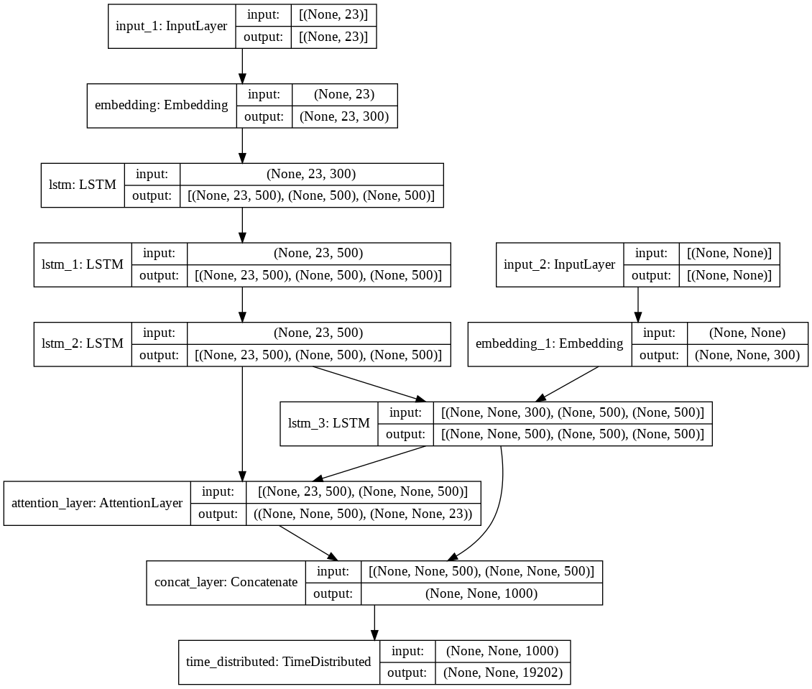

# Abstractive-Summary
Abstractive summarization is the technique of generating a summary of a text from its main ideas, not by copying verbatim most salient sentences from text.


### Dataset:

https://www.kaggle.com/shashichander009/inshorts-news-data

Inshorts is a news service that provides short summaries of news from around the web. This dataset contains headlines and summary of news items along with its source. This dataset includes 55k news and their summaries that I have used as inputs and labels of the model. You can use bigger datasets for better results and more generalization.

### Model:



### Examples of result:

**News Text**:
```qualcomm monday announced chinese court order banning import sale apple iphone iphone models china due software patent violations court found apple violated two qualcomm software patents around resizing photographs managing applications touchscreen apple however said iphones remain sale china```

**Model Prdicted Summary**:
``` qualcomm may face iphone production report```

**Actual Summary**:
```qualcomm wins import ban apple iphones china ```

